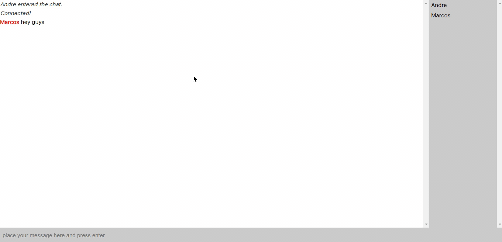

# chat-socket-io
a simple chat with socket-io and node.js 

## Technology stack

* **Back-end:** [Node.Js](https://nodejs.org/en/)
* **Back-end:** [Socket.IO](https://socket.io/)

## Running locally

### Installation
`npm install`

### To run the project
`node src/index.js`

© Marcos Andre